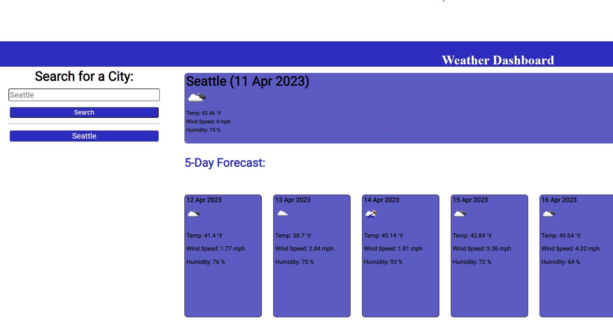

# Weather Application

## Description
Welcome to the weather application! Here you will be able to look at the weather of any place around the world. This application will give you the current weather and a five day forecast. This application was created using HTML, CSS, and JavaScript. Much of the challenge with making this project consisted of integrating a weather API. The weather API returned large sets of data, so I had to specify which data types I needed. This included changing the data to return imperial types for it's metric default and creating a for loop to iterate over an array of forty items to retrieve a five day forecast. 
After completing this assign, I was able to more easily navigate and integrate the data from an API.

## Installation
N/A

## Usage
To use the weather application, type in your desired city in the search bar. Upon searching, you will see a current weather panel of your city at the top and a five day forecast on the bottom. Your search history will be displayed below the search panel if you want to look up a city, again.

## License
Refer to license within the repository.

## Screenshots

## Links
GitHub repository: https://github.com/bear-muna/sixth-challenge

Deployed page: https://bear-muna.github.io/sixth-challenge/